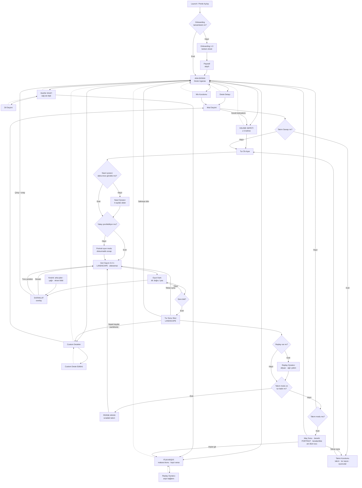

# 02 — Ekranlar ve Akış

## 1. Navigasyon kabuğu: tab bar yok

**Karar: bottom tab bar kaldırıldı.** Ayarlar ana ekranın **sağ üstündeki dişli
butonundan** sheet olarak açılıyor.

Gerekçe: tab bar en az iki sekme gerektirir, ama uygulamanın gerçekten tek bir
kök ekranı var — deste ızgarası. Ayarlar bir varış noktası değil, oturum başına
bir kez uğranan bir yer. Onu sekme yapmak ekranın altından 56pt + safe area
alanı kalıcı olarak götürüyordu; 92 destelik bir ızgarada bu, her ekranda yarım
kart sırası demek. Referans uygulamalar da aynı yolu seçmiş (biri sağ üstte
"Menu", diğeri sol üstte dişli).

### Ana ekran header'ı

| Konum | Öğe | Aksiyon |
|---|---|---|
| Sol üst | **VIP bileti** butonu | Paywall (modal). Premium'da altın onaylı bilet ikonu, tıklanınca abonelik durumu |
| Orta | `CHARADES` marquee logo | — |
| Sağ üst (1) | **Film makarası** ikonu — *koşullu* | Film Arşivi (ekran 22). **Sadece arşivde ≥ 1 kayıt varsa görünür**, üzerinde adet badge'i |
| **Sağ üst (2)** | **Pirinç dişli** | **Ayarlar sheet'i** |

Butonlar `HeaderCircleIconButton` stilinde: 40pt daire, `surfaceCardRaised`
zemin, 1px `accentGold` kenar, ikon `accentBrass`. Scroll aşağı indikçe header
küçülür ama bu butonlar sabit kalır (her zaman erişilebilir).

Makara ikonu koşullu, çünkü kullanıcıların çoğunda replay kaydı kapalı olacak
(varsayılan kapalı, Premium özelliği). Boş bir arşive giden kalıcı bir buton
header'ı gereksiz kalabalıklaştırır. Kayıt yokken arşive tek erişim yolu
ayarlardaki satır.

### Ayarlar sunumu

`.sheet` + `presentationDetents([.large])` + `presentationCornerRadius(28)`,
arka planı kadife perde + grain. Üstte başlık `AYARLAR`, sağ üstte kapatma
butonu, altta `KAPAT`. İçerik § `06`.

### Ekranın altı ne oldu?

Tab bar'dan boşalan alan **PlayBar**'a gidiyor: deste seçildiğinde alttan yükselen
`surfaceCardRaised` bar, solda "2 deste · 260 kart", sağda marquee `OYNA` butonu.
Seçim yoksa bar da yok, tüm alan ızgaraya kalıyor. Yani alt bölge artık sabit bir
navigasyon öğesi değil, bağlama göre çalışan bir aksiyon alanı.

---

## 2. Ekran envanteri

Toplam **24 ekran** + 3 her yerden çıkabilen overlay. Kodlama sırasında bu liste doğrudan iş kalemi listesi
olarak kullanılabilir. Numaralar kimlik, sıra değil — sonradan eklenen ekran
listenin ortasına girse bile numarası sonuncu oluyor, çünkü numaralar dosyalar
arasında referans olarak kullanılıyor ve kaydırmak eski metinleri yalancı yapar.

### Giriş katmanı
| # | Ekran | Tip | Not |
|---|---|---|---|
| 1 | Launch / Splash | Full | Perde açılır (1.2s), ortada **çerçeveli app ikonu**, ampuller yanar. § `02` §4 |
| 2 | Onboarding 1–3 | Bottom sheet | Ana ekran arkada görünür, § `03` |
| 3 | Paywall (onboarding sonu) | Full | Skip linki var, § `03` |

### Ana akış
| # | Ekran | Tip | Not |
|---|---|---|---|
| 4 | Ana Ekran (Deste Izgarası) | **Kök ekran** | Marquee logo, sol üst VIP + sağ üst makara (koşullu) ve dişli, filtre chip'leri, 2/3 kolon grid |
| 5 | Deste Detayı | Sheet | Örnek kelimeler, kart sayısı, "OYNA" |
| 6 | Mix Kurulumu | Full | Çoklu deste seçimi, karışım önizleme |
| 7 | Custom Deste Listesi | Full | Kendi destelerim (max 3) |
| 8 | Custom Deste Editörü | Full | İsim, kapak seçimi, kelime ekleme |
| 9 | Nasıl Oynanır (slider) | Sheet | 4 sayfalı, moda göre içerik değişir |
| 10 | Mod Seçimi | Sheet | 6 mod kartı, § `04` |
| 11 | Takım Kurulumu | Full | Sadece Takım Savaşı modunda |
| 24 | **Kelime Sepeti** | Full | Sadece `ownWords` modunda; kelime yazma + `OYNA` |
| 12 | Tur Ön Ayar | Sheet | Süre, zorluk, kart sayısı |
| 13 | Yatay Çevir Uyarısı | Full | Landscape'e geçiş istemi |
| 14 | Geri Sayım | Full (landscape) | 3-2-1, projektör titremesi |
| 15 | Oyun Kartı | Full (landscape) | Ana oyun, tilt |
| 16 | Duraklat | Overlay | Devam / Yeniden / Çık |
| 17 | Tur Sonu Skor | **Full (landscape)** | Doğru/pas listesi iki kolonda, puan, bilet kağıdı görünümü. Landscape, çünkü süre bitince otomatik geliyor ve telefon o an yatay (§ `09` §1) |
| 18 | Replay Oynatıcı | Full | Kayıt açıksa; zaman çizelgesi işaretleri, altyazı, ağır çekim, paylaş/kaydet/sabitle/sil. § `04` §4.4 |
| 19 | Maç Sonu (Takım) | Full (**portrait**) | Jenerik akışı, kazanan takım, `TEKRAR OYNA` · `PAYLAŞ` · `ARŞİVE GİT`. Beraberlikte ani ölüm turu (§ `09` §5). Yön burada portrait'e döner, "dikey çevir" mikro animasyonuyla |

### Ayarlar (sağ üst dişliden)
| # | Ekran | Tip | Not |
|---|---|---|---|
| 20 | Ayarlar | **Sheet** (`.large`) | 5 grup / 15 satır, § `06` |
| 21 | Dil Seçimi | Sheet (ayarların üzerine) | 25 dil, her biri kendi dilinde, § `06` |

### Film Arşivi (header'daki makara ikonundan veya ayarlardan)
| # | Ekran | Tip | Not |
|---|---|---|---|
| 22 | Film Arşivi | Full | Maça göre gruplanmış kayıtlar, yatay sahne kartları, çoklu seçim. § `04` §4.3 |
| 23 | Replay Oynatıcı (arşivden) | Full | Ekran 18 ile **aynı view**, farklı giriş noktası |

### Her yerden çıkabilenler
- Paywall (modal varyant) — kilitli deste veya kilitli moda dokunuşta
- Puanla bizi sheet'i — ilk başarılı turdan sonra
- Bildirim izni soft prompt'u — ana ekranda 8 saniye gecikmeli

---

## 3. Ana akış diyagramı

Kısayol: kesikli oklar **geri dönüş** yollarıdır. Her ekranın kapanış yolu
çizilmek zorunda — önceki sürümde Duraklat, oyundan çıkış ve arşivden dönüş
diyagramda yoktu ve bu, kullanıcının oyunda kilitli kalabileceği bir boşluk
bırakıyordu (§ `09` §3).



Diyagramda düzeltilen dört yapısal hata:

1. **Duraklat ve çıkış yolu yoktu.** `R`'den tek çıkış "süre bitti" idi; oyuna
   giren kullanıcının turu bitirmeden dönme yolu diyagramda hiç görünmüyordu.
   Oyun akışı `NavigationStack`'in yerine render edildiği ve swipe-back kapalı
   olduğu için bu, gerçekten kilitlenme riski demekti.
2. **Arşiv, oyun akışına bağlanmıştı.** `AR → V → W` zinciri, sadece eski
   kaydını izleyen kullanıcıyı "tur kaldı mı?" kararına ve oradan geri sayıma
   düşürüyordu. Arşiv oynatıcısı artık ayrı bir düğüm (`ARV`) ve arşive dönüyor.
3. **Takım olmayan modlar takım maç sonuna gidiyordu.** `W -- Hayır --> X` her
   modda geçerliydi, yani tek başına Klasik oynayan kullanıcıya "BAŞ ROL /
   KIRMIZI TAKIM" jeneriği açılıyordu. `Y` kararı eklendi.
4. **`TEKRAR OYNA` ve `SAHNEYE DÖN` kenarları yoktu.** Ekran 17'de tanımlı
   butonların akışta karşılığı yoktu; oysa "tur bitti, tekrar oynayalım"
   uygulamanın en yüksek frekanslı aksiyonu.

---

## 4. Ekran detayları

### 1 — Launch / Splash

Tek işi var: uygulama hazırlanırken geçen 1,2 saniyeyi boş bir yükleme ekranı
yerine **perde açılışına** çevirmek. Mockup'ta iki kare halinde duruyor
(`ornek-ekranlar.html`, cihaz 1a ve 1b).

**Anatomi — merkezden dışa:**

1. **Çerçeveli app ikonu (ortada).** Üç katman:
   - dışta pirinç profil, dört köşesinde vida başı;
   - içte krem paspartu (`--surface-poster`);
   - ortada 104 pt ikon, `teslim/app-ikonu/ikon-1024.png`.

   Neden çerçeve: ikon çerçevesiz konduğunda "yükleniyor" ekranındaki bir logo
   gibi duruyor. Çerçeve onu **sergilenen bir eser** yapıyor — müzede tablo,
   sinemada afiş. Tema da bunu istiyor.

   Neden bu dosya: splash'ta ayrı bir logo çizimi kullanmıyoruz. App Store'da
   görülen simge ile açılışta görülen simge **aynı** olmalı, yoksa kullanıcı
   doğru uygulamayı açtığını bir an sorguluyor.

2. **Çerçevenin çevresinde marquee ampulleri.** Ana ekrandaki logo ampulleriyle
   aynı ritim: 1,5 sn nabız, ampul başına 0,11 sn kademeli gecikme. Splash'ta
   yanan ampuller ana ekranda aynı tempoda devam ediyor; iki ekran arasında
   kesinti değil süreklilik oluyor.

3. **Altında wordmark.** `CHARADES` (Oswald Bold 34, harf aralığı 6) ve altında
   pirinç çizgiler arasında `SESSİZ SİNEMA` — dile göre değişen mod adı değil,
   sabit alt başlık.

4. **İki kadife perde kanadı.** Kapalıyken ortada birleşiyor, birleşme yerinde
   ince altın şerit var. Açılma davranışı § `08` §A3'te.

5. **Alt kenarda yükleme göstergesi.** Akan ince amber çizgi + `MAKARA
   YÜKLENİYOR`. **Normal açılışta hiç görünmüyor.** Yalnızca ilk kurulumda
   (katalog ilk kez ayrıştırılırken) veya içerik güncellemesinde beliriyor.

**Zamanlama:**

| Durum | Davranış |
|---|---|
| Normal soğuk açılış | 1,2 sn perde animasyonu, sonra ana ekran |
| Hazırlık 1,2 sn'den kısa sürdü | Yine 1,2 sn bekleniyor — yarım kesilmiş animasyon, hızlı açılıştan kötü hissettiriyor |
| Hazırlık uzadı | Perde açık kalıyor, yükleme göstergesi devreye giriyor, 8 sn sonra hata durumu (§ `09`) |
| Arka plandan dönüş | Splash **yok**, doğrudan son ekran |
| Reduced Motion açık | Perde animasyonu yerine 200 ms fade; çerçeveli ikon yine görünüyor, ampuller sabit yanıyor |

Splash'ta **hiçbir dokunulabilir öğe yok** — atlama butonu bile. 1,2 saniye
bir butonu fark edip basmak için kısa, buton görsel gürültüden başka bir şey
olmuyor.

### 4 — Ana Ekran (Deste Izgarası)

Yukarıdan aşağıya:

1. **Header (sabit, scroll'da küçülür)**
   - Orta: `CHARADES` marquee logo — Oswald Bold 44, çevresinde 14 ampul,
     sıralı yanıp sönme.
   - **Sol üst: VIP bileti butonu** (premium değilse amber bilet, premium ise
     altın onaylı bilet). Paywall'a gider.
   - **Sağ üst: film makarası** (koşullu, arşivde kayıt varsa) → Film Arşivi.
   - **Sağ üst: pirinç dişli** → Ayarlar sheet'i.
   - Logonun altında ince altın çizgi + `SESSİZ SİNEMA` sekonder etiketi.
   - Scroll'da logo 44 → 24'e küçülür, iki buton boyutunu korur.

2. **Filtre chip satırı** (yatay scroll, sticky) — **16 chip**
   `TÜMÜ` · `POPÜLER` · `YENİ` · `PARTİ` · `CANLANDIR` · `FİLM & TV` · `MÜZİK` ·
   `ÇOCUK` · `SPOR` · `BİLGİ` · `MARKA` · `NOSTALJİ` · `DÜNYA` · `HAYVANLAR` ·
   `EV` · `SEZON`
   Aktif chip: `accentAmber` zemin, `textOnAmber` metin, ampul çerçeve.
   Pasif: şeffaf + `accentGold` kenar.
   `SEZON` sadece ilgili tarih penceresinde, `POPÜLER` ve `YENİ` dinamik hesaplanır.
   Chip sayısı 16'ya çıktığı için satır sonunda sağa doğru bir gradient fade
   olacak — kaydırılabilir olduğu görsel olarak belli olsun.

   > **Düzeltme:** Liste önceden 15 chip'ti ve 13 bölümden **`MARKA & TEKNOLOJİ`
   > eksikti** (3 dinamik chip + 12 bölüm chip'i). O bölümün 8 destesi — 6'sı
   > v1'de — filtreyle hiç erişilemiyordu. Chip sayısı bölüm sayısıyla eşleşmek
   > zorunda: 3 + 13 = 16. Bunu CI'da doğrulayan bir test eklenecek (§ `05` §5).

3. **"ŞİMDİ VİZYONDA" şeridi** — günlük bedava desteyi duyuran marquee bandı:
   solda küçük ampullü çerçeve içinde destenin kartı, sağda `BUGÜN BEDAVA` +
   deste adı + geri sayım (`14:22:07`). Dokununca doğrudan Deste Detayı açılır.
   Premium kullanıcıda bu şerit gizlenir (onun için anlamsız).

4. **"BENİM DESTELERİM" bölümü** — `sectionLabel` başlık + sağda grid toggle
   (2 kolon / 3 kolon). Kullanıcının ücretsiz + satın alınmış + custom desteleri.

5. **Öne çıkan satır (yatay scroll):** `MIX`, `KENDİ KELİMELERİN` ve
   `CUSTOM DESTE` kartları burada, diğerlerinden farklı görsel dille (Mix: dönen
   film makarası; Kendi Kelimelerin: boş bilet + kalem; Custom: boş afiş + artı).
   `KENDİ KELİMELERİN` kartının burada olması zorunlu, tercih değil: bu mod deste
   seçmiyor, dolayısıyla "deste seç → mod seç" hattından erişilemez. Aynı sebeple
   `MIX` de zaten burada.

6. **Deste ızgarası** — 3:4 kartlar, 2 veya 3 kolon, 12pt aralık. Kilitli kartlar
   sepia + kilit + "BİLET GEREKLİ" mührü. Lazy yükleme.

7. **PlayBar (alt sabit, sadece seçim varsa)** — `surfaceCardRaised` zemin,
   solda "2 deste · 260 kart", sağda marquee `OYNA` butonu. Tab bar olmadığı için
   doğrudan safe area'nın üzerinde oturur. Seçim yoksa bar görünmez ve tüm dikey
   alan ızgaraya kalır.

Kaydırma davranışı: aşağı kaydırınca header küçülür (logo 44 → 24), chip satırı
yapışır, VIP ve dişli butonları sabit kalır.

### 5 — Deste Detayı (sheet)

Üstte 3:4 kart görseli (blur'lu arka plan olarak da kullanılır), altında:
- Playfair Display başlık + kısa açıklama (lokalize)
- Meta satırı: `130 KART` · `KOLAY` · `4+ OYUNCU`
- **Örnek kelimeler:** 6 kelime, kağıt etiket görünümünde chip'ler. Premium
  olmayan kullanıcıya kilitli destede de gösterilir — merak uyandırır.
- Butonlar: birincil `OYNA`, ikincil `MIX'E EKLE`, ikon buton `FAVORİ`
- Kilitliyse birincil buton `BİLETİ AL` olur ve paywall'ı açar.

### 9 — Nasıl Oynanır (slider)

**Senin özellikle istediğin ekran.** 4 sayfalı yatay slider, sheet içinde.
İlerleme göstergesi: film şeridi kareleri (aktif kare amber, geçilenler altın,
gelecekler soluk) — nokta yerine tema ile uyumlu.

Onboarding 3 adıma indikten sonra **detaylı anlatımın tek sahibi bu ekran**
(§ `03` §1). Eskiden ikisi aynı 4 sayfayı anlatıyordu; şimdi onboarding ikna
ediyor, bu slider talimat veriyor. Pratik sonucu: bu slider **kısaltılmayacak**,
çünkü artık yedeği yok. Mim illüstrasyonu da (`ob_mime`) yalnızca burada,
sayfa 3'te kullanılıyor.

Klasik/Takım/Hız modları için içerik:

| Sayfa | Başlık | Metin | Görsel |
|---|---|---|---|
| 1 | DESTENİ SEÇ | Onlarca temalı desteden birini ya da birkaçını karıştır. | Yelpaze gibi açılmış 4 afiş |
| 2 | TELEFONU ALNINA KOY | Ekranı arkadaşlarına göster, kelimeyi sadece onlar görsün. | Yandan silüet: telefon alında, karşıda 3 kişi |
| 3 | ONLAR ANLATSIN | Konuşmadan canlandırsınlar, sen tahmin et. | Mim yapan figür, üstünde konuşma balonu çizili-üstü |
| 4 | EĞ VE CEVAPLA | Öne eğ = DOĞRU. Arkaya eğ = PAS. | Telefonun iki yöne eğildiği diyagram, yeşil/kırmızı |

`Canlandır` modu seçilmişse sayfa 2 ve 3 yer değişir ve metinler "sen canlandır,
onlar tahmin etsin" olarak değişir. `usesTilt == false` olan bir mod eklenirse
sayfa 4 otomatik gizlenir.

Gösterim kuralı: mod başına **bir kez** otomatik gösterilir
(`howToSeen: Set<String>` UserDefaults'ta). Sonrasında Deste Detayı ve Duraklat
ekranındaki `?` butonundan her zaman açılabilir.

### 24 — Kelime Sepeti (`ownWords` modu)

Mod seçiminde `Kendi Kelimelerin` seçilince açılan tam ekran. Tek işi var:
kullanıcı kelimeleri yazsın ve oyuna girsin.

```
┌──────────────────────────────────┐
│  ‹                        ?      │
│                                  │
│      K E L İ M E   S E P E T İ   │  ← marquee başlık
│   Aklınıza geleni yazın, gerisi  │
│         bize kalsın              │
│                                  │
│  ┌────────────────────────┐ ┌──┐ │
│  │ kelime yaz…            │ │＋│ │  ← klavye açık kalır
│  └────────────────────────┘ └──┘ │
│                                  │
│   7 / 100 KELİME    ▸ TOPLU EKLE │
│                                  │
│  ┌────────────────────────────┐  │
│  │ AYŞE'NİN KÖPEĞİ         ✕ │  │  ← en yeni üstte
│  │ MÜDÜRÜN ARABASI         ✕ │  │
│  │ ...                       │  │
│  └────────────────────────────┘  │
│                                  │
│  ▁▁▁▁▁▁▁▁▁▁▁▁▁▁▁▁▁▁▁▁▁▁▁▁▁▁▁▁▁  │
│         [  O Y N A  ]            │  ← PlayBar ile aynı dil
└──────────────────────────────────┘
```

| Öğe | Davranış |
|---|---|
| Giriş alanı | Odak ekran açılışında **otomatik**. Enter kelimeyi ekler ve alanı boşaltır, **klavye kapanmaz** — 10 kelime yazan kullanıcı için tek önemli detay bu |
| Eklenen kelime | Listenin **başına** girer (yazdığını görmesi için), kağıt etiket görünümünde, sağında `✕` |
| Silme | `✕` veya satırı sağa kaydırma |
| Sayaç | `7 / 100 KELİME`. 5'in altında `OYNA` disabled + "En az 5 kelime" |
| Toplu ekle | Çok satırlı alan; satır ya da virgülle ayırır. Hazır listesi olan kullanıcı için (§ `05` §7 ile aynı bileşen) |
| Tekrar eden kelime | Sessizce eklenmez, mevcut satır bir an amber yanar. Uyarı metni çıkmıyor — parti ortamında modal okunmuyor |
| `?` butonu | Nasıl Oynanır slider'ı |
| `‹` | Mod seçimine döner. **Yazılanlar korunur** (`GameSetup` içinde), kullanıcı yanlışlıkla çıkıp döndüğünde 12 kelimesi silinmiş olmaz |

Kelime sayısı önerisi: 5 minimum ama **20 tavsiye edilir.** 60 saniyelik turda
~15 kelime geçiyor; 5 kelimelik sepette havuz turun ortasında bitip başa dönüyor
(§ `09` §4). Sayaç 20'nin altındayken altında tek satır bilgi duruyor:
"60 saniyede ~15 kelime geçiyor, 20 kelime öneririz." Engel değil, tavsiye.

Kaydetme **bu ekranda yok, tur sonunda soruluyor.** Sebep: kullanıcı buraya
oynamak için geldi, kaydetmeyi henüz düşünmüyor; ekranın başına "isim ver" alanı
koymak tam olarak custom deste editörünün akışa taktığı frendi geri getirir.
Tur Sonu ekranında `SEPETİ KAYDET` şeridi çıkar, isim orada isteniyor
(varsayılan doldurulmuş: `KENDİ KELİMELERİM · 24 TEMMUZ`). Kaydedilen sepet
custom desteye dönüşür ve limitlere tabi olur (§ `05` §7). Kaydedilmezse
`GameSetup` ile birlikte kaybolur — bu kayıp **açıkça** söylenir, yoksa kullanıcı
20 kelimesini kaybettiğini sonradan fark eder.

Ücretsiz kullanıcı bu ekranı **hiç görmüyor.** Mod kartı kilitli, dokunuş
doğrudan paywall açıyor (§ `09` §9). 20 kelime yazdırıp sonunda paywall
göstermek, § `09`'un başka bir yerde reddettiği yem-değiştir davranışının aynısı.

### 13 — Yatay Çevir Uyarısı

Tam ekran, ortada dönen telefon ikonu animasyonu + `TELEFONU YATAY ÇEVİR`.
Cihaz landscape'e geldiğinde otomatik ilerler (buton yok). Alt kısımda küçük
"Yatay çeviremiyorum" linki → dokunmatik moda geçer (tilt kapalı, ekranın
yarılarına dokunma ile oynanır).

### 15 — Oyun Kartı (landscape)

- Zemin `surfacePoster`, üst ve altta film sprocket şeridi.
- Ortada kelime: Oswald Bold, 96'dan başlayıp sığana kadar küçülür (min 44).
- Sol üst: kalan süre, büyük mono rakamlar; son 10 saniyede `stateWarning`e döner
  ve her saniye hafif haptic + retro "tik" sesi.
- Sağ üst: `DOĞRU 7` sayacı.
- Alt orta: çok küçük `PAS ↰ | ↱ DOĞRU` hatırlatıcısı (ilk 3 turda görünür).
- Tilt cevabı: tam ekran renk basar (yeşil/kırmızı), ortada damga animasyonu
  (`DOĞRU` / `PAS` eğik mühür), 0.45s sonra sonraki kelime yukarıdan düşer.
- Duraklat: iki parmakla dokunma veya üst kenardan aşağı sürükleme.

### 17 — Tur Sonu Skor

Bilet kağıdı (`surfaceTicket`) görünümünde **iki kolon**: solda doğrular yeşil
noktayla, sağda paslar kırmızı noktayla, aralarında dikey perfore çizgi. Landscape
olduğu için tek kolon ekranın yarısını boş bırakıyordu. Üstte takım/tur adı ve
büyük doğru sayısı.

**Yanlış işaretlenen kelimeye dokunarak düzeltme** yapılabilir (parti oyunlarında
kritik: "o aslında doğruydu!"). Kelime kolonlar arasında yer değiştirir ve üstteki
puan anında güncellenir. Bu yüzden ekranda "dokunarak düzeltebilirsin" ipucu
satırı var — yoksa özelliğin varlığı keşfedilmiyor.

**Alt butonlar moda göre değişiyor.** Önceki sürümde burada `TEKRAR OYNA` /
`SIRADAKİ TAKIM` / `SAHNEYE DÖN` üçlüsü sabit yazılıydı; Klasik modda sıradaki
takım diye bir şey olmadığı için bu üçlü olduğu gibi çıkamaz:

| Durum | Birincil buton | Yanındakiler |
|---|---|---|
| Klasik · Mix · Hız Turu · Kendi Kelimelerin | `TEKRAR OYNA` | `SAHNEYE DÖN` · (kayıt varsa) `REPLAY'İ İZLE` |
| Canlandır | `TEKRAR OYNA` | `SAHNEYE DÖN` · (kayıt varsa) `REPLAY'İ İZLE` |
| Takım Savaşı, oynanacak tur kaldı | `SIRADAKİ TAKIM` → Perde Arası (§ `08` §B2) | `PAYLAŞ` · (kayıt varsa) `REPLAY'İ İZLE` |
| Takım Savaşı, son tur da bitti | `JENERİĞE GEÇ` → ekran 19 | `PAYLAŞ` |

`REPLAY'İ İZLE` yalnızca o turda kayıt alındıysa görünüyor (Ayarlar'da replay
kapalıysa buton hiç yok, boş kalan yeri diğerleri paylaşıyor). Mockup'taki cihaz
17 Takım Savaşı durumunu gösteriyor.

---

## 5. Navigasyon mimarisi

- Kök: tek bir `NavigationStack` + `NavigationPath`. `TabView` **yok.**
- Rotalar: `enum AppRoute: Hashable { case mix, customList, customEditor(String?), wordBasket, teamSetup, archive, archivePlayer(String) }`
  (Deste Detayı, Mod Seçimi, Tur Ön Ayar, Ayarlar ve Dil sheet olarak sunulur,
  path'e girmez.) `archive` ve `archivePlayer` **oyun akışının dışında** —
  Film Arşivi'nden açılan oynatıcı, tur sonunda açılan oynatıcı ile aynı view'ı
  kullanır ama farklı yere döner: arşive, oyun akışına değil.
- Oyun akışı **navigation stack'e push edilmez.** Oyun başlarken `LiveGame`
  nesnesi oluşur ve `NavigationStack`'in tamamının yerine `GameFlowView` render
  edilir. Sebep: oyun sırasında geri butonu ve swipe-back olmamalı; yanlışlıkla
  turu bölmek en can sıkıcı hata olur.
- `LiveGame == nil` olduğunda ana yapı geri döner, kullanıcı bıraktığı scroll
  pozisyonunda bulur.
- Faz makinesi: tek kaynak § `07` §5'teki `LivePhase`. Bu dosyada ayrıca
  tanımlanmıyor — önceden burada `teamHandoff` içermeyen eksik bir kopyası vardı
  ve iki döküman çelişiyordu.
- Ekranlar `navigationBarHidden(true)` kullandığı için native swipe-back kaybolur;
  `Imposter` projesindeki `.onSwipeBack { }` modifier'ı taşınacak.

---

## 6. Boş ve hata durumları

| Durum | Ne gösterilir |
|---|---|
| Custom deste yok | Boş afiş çerçevesi + "İlk destenizi yazın" + `DESTE OLUŞTUR` |
| Custom destede < 5 kelime | `OYNA` disabled + "En az 5 kelime gerekli" |
| Mix'te tek deste seçili | "Mix için en az 2 deste seç" |
| Filtre sonucu boş | Film şeridi ikonu + "Bu bölümde henüz deste yok" |
| Motion sensörü yok/izin sorunu | Otomatik dokunmatik moda düşer, bilgi banner'ı |
| Kamera izni reddedildi (replay) | Replay ayarı kapatılır + ayarlara yönlendiren metin |
| Satın alma başarısız | Sheet üzerinde retro "BİLET GEÇERSİZ" uyarısı + tekrar dene |
| Ağ yok (paywall) | Fiyatlar yerine iskelet (shimmer) + "Bağlantı bekleniyor" |
